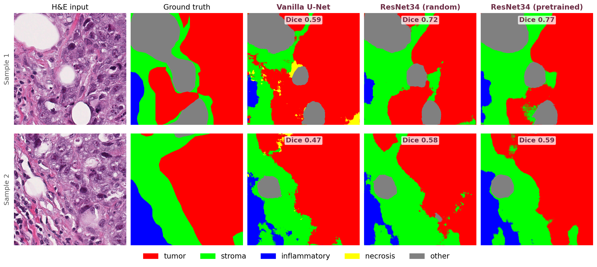

<div align="center">

# Breast Cancer Tissue Segmentation with U-Net

#### Encoder depth vs. transfer learning, a controlled study on the BCSS dataset

    

<br/>



<sub><b>H&amp;E input · ground truth · Vanilla U-Net · ResNet-34 (random) · ResNet-34 (pretrained)</b></sub>

</div>

---

Pixel-level segmentation of breast cancer H&E slides from the **BCSS** dataset into five tissue classes (tumor, stroma, inflammatory, necrosis, other). The study isolates how much of the gain from a ResNet-34 encoder comes from the architecture itself versus ImageNet pretraining, by training three variants under one identical, leakage-free setup:

|  | Variant | Encoder | Initialization |
|:--:|---------|---------|----------------|
| 1 | **Vanilla U-Net** | classic double-conv | from scratch |
| 2 | **ResNet-34 U-Net** | ResNet-34 | random |
| 3 | **ResNet-34 U-Net** | ResNet-34 | ImageNet |

A deeper encoder accounts for most of the improvement, while pretraining adds a smaller but consistent gain, and it does so with **fewer parameters** (24.4M vs. 31.0M). The clearest jump is on the rarest class, necrosis, where Dice rises from **0.59 to 0.83**.

## Results

Held-out test patients (patient-level split, no leakage):

| Model | mean Dice | mean IoU | pixel acc. |
|-------|:---------:|:--------:|:----------:|
| FCN baseline _(Amgad 2019)_ | ~0.75 | ~0.61 | n/a |
| Vanilla U-Net | 0.760 | 0.622 | 0.806 |
| ResNet-34 _(random)_ | 0.809 | 0.683 | 0.849 |
| **ResNet-34 _(ImageNet)_** | **0.824** | **0.704** | **0.857** |

Per-class numbers, training curves, error analysis, and the out-of-domain tests are in [`report/report.pdf`](report/report.pdf).

## Project structure

```
report/      IEEE-style report (Typst source + compiled 8-page PDF)
src/         model, dataset and training code imported by the notebooks
notebooks/   the experiments (training notebooks ship with full cell outputs)
results/     metrics and tuned hyperparameters (json / csv)
```

<details>
<summary><b>Full layout</b></summary>

```
.
├── README.md
├── requirements.txt
├── report/
│   ├── report.pdf            # 8-page, double-column
│   ├── report.typ            # Typst source
│   ├── references.yml
│   └── figures/
├── src/
│   ├── config.py             # class names, colors, image size
│   ├── dataset.py            # BCSS dataset + Albumentations pipeline
│   ├── models.py             # VanillaUNet and ResNet34UNet
│   ├── train_utils.py        # CE+Dice loss, count-based metrics, loop, scheduler
│   └── visualize.py          # plots and prediction overlays
├── notebooks/
│   ├── hyperparameter_tuning.ipynb
│   ├── train_vanilla_unet.ipynb
│   ├── train_resnet34_random.ipynb
│   └── train_resnet34_pretrained.ipynb
└── results/
    ├── best_params.json      # Optuna-selected hyperparameters
    ├── model_comparison.csv  # per-class / overall test metrics
    └── tiger_metrics.json    # external TIGER scores
```
</details>

## Notebooks

| Notebook | Description | Cell outputs |
|----------|-------------|:------------:|
| `hyperparameter_tuning.ipynb` | Optuna search (25 trials): learning rate, weight decay, batch size, optimizer, loss | source only \* |
| `train_vanilla_unet.ipynb` | Vanilla U-Net from scratch (50 epochs) + evaluation | yes |
| `train_resnet34_random.ipynb` | ResNet-34 encoder, random init | yes |
| `train_resnet34_pretrained.ipynb` | ResNet-34 encoder, ImageNet init | yes |

The three training notebooks were executed on a **Kaggle GPU** and retain their outputs, so the data preview, augmentation samples, per-epoch loss/metric curves, confusion matrix, and final metrics read end-to-end without rerunning.

> \* The tuning run was executed on Google Colab; its result is stored in [`results/best_params.json`](results/best_params.json) and reused by all three training notebooks. Selected configuration: **Adam**, learning rate ≈ 9.2e-5, batch size 16, cross-entropy + Dice loss.

## Setup

```bash
pip install -r requirements.txt
```

1. Prepare the BCSS 512×512 data as `train/`, `valid/`, `test/` (patient-level split, seed 42).
2. Put `src/` on the path. On Kaggle the modules are attached as a dataset and added to `sys.path`; locally, run the notebooks from a directory where `src/` is importable.
3. Run the training notebooks; each saves per-epoch checkpoints and an evaluation summary.

Per the course instructions, the prepared data and trained weights are **not** included here (too large). The dataset link is below.

## Dataset

**Breast Cancer Semantic Segmentation (BCSS)**, Amgad et al., _Bioinformatics_ 35(18):3461–3467, 2019, 512×512 version. The 22 original tissue codes are grouped into the five modeled classes; unmapped codes go to an ignore label.

https://github.com/PathologyDataScience/BCSS

## External generalization

Because BCSS is sourced entirely from TCGA, the models are also evaluated out of domain on the **TIGER** challenge ROIs (scored separately for TCGA-source and genuinely external hospital slides) and shown qualitatively on the **TNBC** set. The in-domain ranking holds out of distribution, with a large but honest domain gap.

| Test set (macro Dice) | Vanilla | RN34 random | RN34 pretrained |
|-----------------------|:-------:|:-----------:|:---------------:|
| BCSS (in-domain) | 0.760 | 0.809 | **0.824** |
| TIGER (TCGA) | 0.357 | 0.334 | **0.490** |
| TIGER (external) | 0.333 | 0.322 | **0.371** |

Scores in [`results/tiger_metrics.json`](results/tiger_metrics.json); discussion in the report.

## Report

Written in [Typst](https://typst.app). The compiled PDF is included; to rebuild:

```bash
cd report && typst compile report.typ report.pdf
```

The architecture figure is drawn natively with the `neural-netz` package, fetched once on first compile and then cached.
